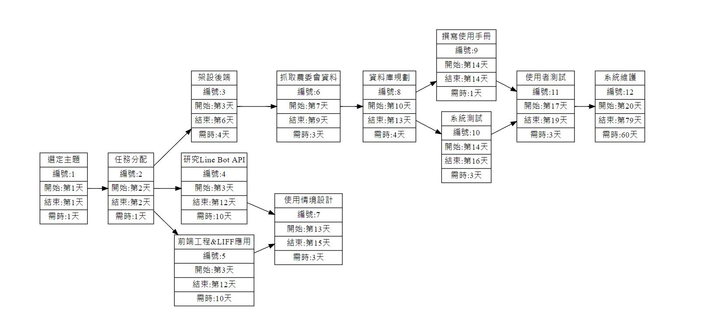

# 2021_3B_第四組
主要目的：1. 為使用者省下大量的荷包 2.幫助農民銷售當季過剩農產品

### 產品特色：
1. 小資族無時無刻都在精打細算，而透過殺必鼠這款Line Bot，就能e指輕鬆查詢市價，以便宜的價錢買到划算的商品。 
2. 新手想下廚？卻又不知道菜價如何，一進菜市場就像任人宰割的韭菜，有了這款殺必鼠Line Bot，不只能夠查詢合理市價，更能夠擺脫任人宰割的命運。 
3. 農產品過剩？別擔心，殺必鼠Line Bot會自動推廣當季過剩農產品，讓農民辛苦的成果不被浪費。

### 系統規劃：
1. 使用Python爬蟲程式，透過農產品交易行情的API，將產品市價寫入資料庫，除此之外，透過全新獨創的智慧比價系統，找出最經濟實惠的菜單組合供使用者參考。 
2. 自架Pyton-flask 與 Line-developerSDK 與 利用web hook 與Line官方伺服器(Line Bot API)進行溝通，用戶資料儲存於NoSQL中方便查詢。

## 組員
***
| 學號  | 姓名  | 
| :------------: |:---------------:|
| C108118204 | 沈翔竣 | 
| C108118206 | 陳風熏 | 
| C108118208 | 楊麗蓉 | 
| C108118222 | 蘇裕凱 | 
| C108118240 | 楊翔鴻 | 
| C108118245 | 陳名鈞 | 
***
## 工作分解結構清單
|編號    | 任務說明	   |需時（天）	|前置任務|
|:------:|:---------:|:--------:|:-----:|
|1	    | 選定主題	          | 1		   | -|
|2	    | 任務分配	          | 1		   | 1|
|3	    | 架設後端	          | 4		 | 2|
|4	    | 研究Line Bot API	 | 10		 | 2|
|5	    | 前端工程&LIFF應用   | 10		| 2|
|6	    | 抓取農委會資料	     | 3		 | 3|
|7	    | 使用情境設計	      | 3		  | 4,5|
|8	    | 資料庫規劃	         | 4		 | 6|
|9	    | 撰寫使用手冊	      | 1		  | 8|
|10	    | 系統測試	          | 3		 | 8|
|11	    | 使用者測試	        | 3		  | 9,10|
|12	    | 系統維護	         | 60		 | 11|

## 工作分配
|工作內容      |  姓名 |  
|:--------------:|:-----:|
|研究並實作Line Bot API | 蘇裕凱|
|後端開發處理&爬蟲       | 楊翔鴻|
|資料庫規劃             | 陳風熏|
|使用情境與前端設計     | 沈翔竣|
|撰寫使用手冊          |沈翔竣|
|前端工程&LIFF應用      |陳名鈞、楊麗蓉|
|系統測試              |全員|
|系統維護              |蘇裕凱、楊翔鴻、陳風熏|

## PERT/CPM

## 關鍵路徑

## 甘特圖

