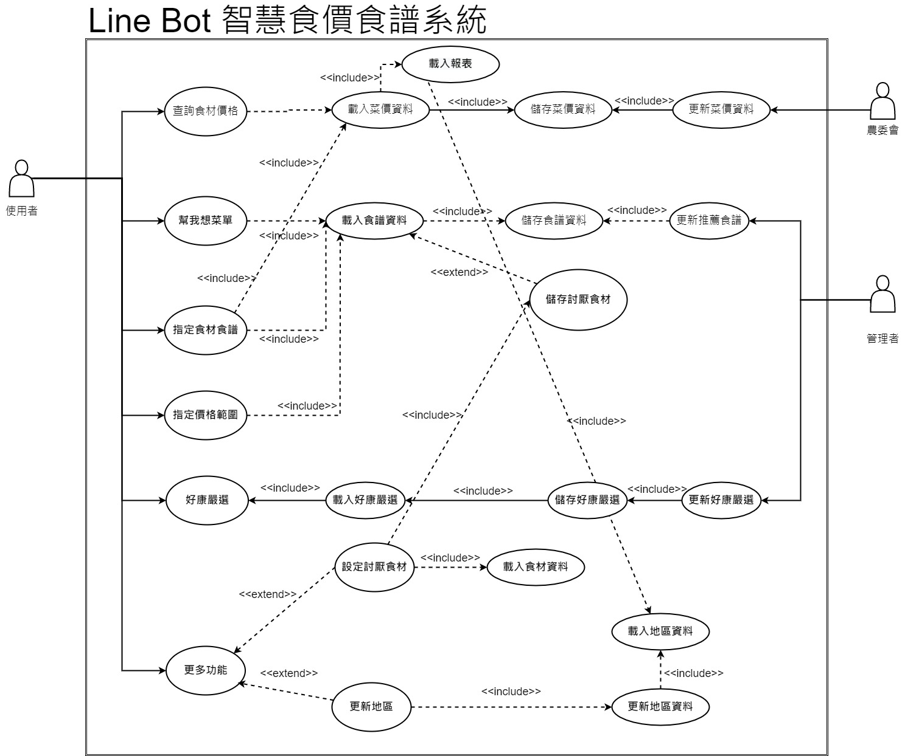

# 2021_3B_第四組 hw2
# 題目：LineBot智慧食價食譜

## 組員
***
| 學號  | 姓名  | 
| :------------: |:---------------:|
| C108118204 | 沈翔竣 | 
| C108118206 | 陳風熏 | 
| C108118208 | 楊麗蓉 | 
| C108118222 | 蘇裕凱 | 
| C108118240 | 楊翔鴻 | 
| C108118245 | 陳名鈞 | 
***
## 功能性需求
1. 讓使用者剛加入機器人時選擇查詢食材的地區
2. 查詢各樣食材的價格
3. 讓系統自動生成菜單提供使用者
4. 讓使用者指定食材食譜
5. 讓使用者能夠輸入指定金額以及範圍
6. 提供使用者各項好康，像是DM一樣
7. 提供更多功能，裡面包含讓「新手教學」、「讓使用者除去不喜歡吃的食材（透過LIFF）」、「更改查詢食材的地區」、「基本Q&A」

## 非功能性需求
1. 反應時間(response time) ：1秒鐘以內要產出回覆。
2. 使用性(usability)：使用者只需要1分鐘就能上手。 
3. 可靠度(reliability)：系統可全天候24h上線，非人為斷線的機率為0.00001%。
4. 效能(performance)：由於採用多執行緒，因此可以承載5,000人同時發送請求。
5. 維護性(maintainability)：主要採用Python進行開發，命名請勿使用a,b,c等奇怪命名。

## FDD

## 需求分析

## 使用案例圖 Use Case Diagram

## 使用案例說明

