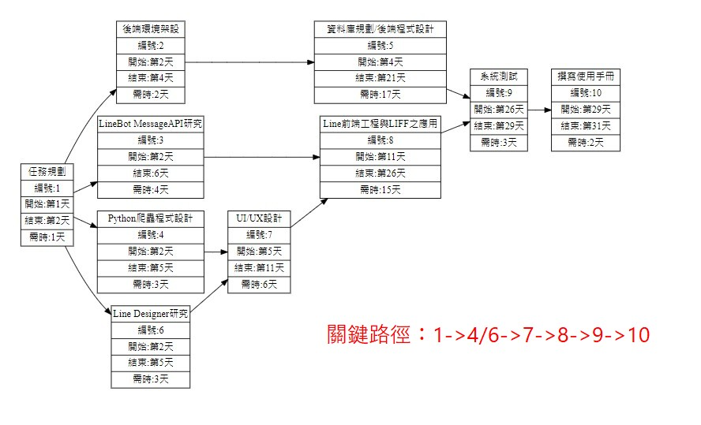

# 2021_3B_第四組
# 題目：LineBot智慧食價食譜
# 快速連結[作業一](#作業一) [作業二](#作業二) [作業三](#作業三)
## 作業一
### 目標：
本提案的主要目的為讓使用者透過Line Bot輕鬆了解農產品的市價，不只如此，還能自動推薦最經濟實惠的菜單供使用者參考購買。 
目標客群：小資族、下廚新手 
主要目的：1. 為使用者省下大量的荷包 2.幫助農民銷售當季過剩農產品

### 產品特色：
1. 小資族無時無刻都在精打細算，而透過殺必鼠這款Line Bot，就能e指輕鬆查詢市價，以便宜的價錢買到划算的商品。 
2. 新手想下廚？卻又不知道菜價如何，一進菜市場就像任人宰割的韭菜，有了這款殺必鼠Line Bot，不只能夠查詢合理市價，更能夠擺脫任人宰割的命運。 
3. 農產品過剩？別擔心，殺必鼠Line Bot會自動推廣當季過剩農產品，讓農民辛苦的成果不被浪費。

### 系統規劃：
1. 使用Python爬蟲程式，透過農產品交易行情的API，將產品市價寫入資料庫，除此之外，透過全新獨創的智慧比價系統，找出最經濟實惠的菜單組合供使用者參考。 
2. 自架Pyton-flask 與 Line-developerSDK 與 利用web hook 與Line官方伺服器(Line Bot API)進行溝通，用戶資料儲存於NoSQL中方便查詢。

## 組長
C108118240 楊翔鴻
## 組員
***
| 學號  | 姓名  | 
| :------------: |:---------------:|
| C108118204 | 沈翔竣 | 
| C108118206 | 陳風熏 | 
| C108118208 | 楊麗蓉 | 
| C108118222 | 蘇裕凱 | 
| C108118245 | 陳名鈞 | 
***
## 工作分解結構清單
|編號    | 任務說明	   |需時（天）	|前置任務|
|:------:|:---------:|:--------:|:-----:|
|1	    | 選定主題	          | 1		   | -|
|2	    | 任務分配	          | 1		   | 1|
|3	    | 架設後端	          | 4		 | 2|
|4	    | 研究Line Bot API	 | 10		 | 2|
|5	    | 前端工程&LIFF應用   | 10		| 2|
|6	    | 抓取農委會資料	     | 3		 | 3|
|7	    | 使用情境設計	      | 3		  | 4,5|
|8	    | 資料庫規劃	         | 4		 | 6|
|9	    | 撰寫使用手冊	      | 1		  | 8|
|10	    | 系統測試	          | 3		 | 8|
|11	    | 使用者測試	        | 3		  | 9,10|
|12	    | 系統維護	         | 60		 | 11|

## 工作分配
|工作內容      |  姓名 |  
|:--------------:|:-----:|
|研究並實作Line Bot API | 蘇裕凱|
|後端開發處理&爬蟲       | 楊翔鴻|
|資料庫規劃             | 陳風熏|
|使用情境與前端設計     | 沈翔竣|
|撰寫使用手冊          |沈翔竣|
|前端工程&LIFF應用      |陳名鈞、楊麗蓉|
|系統測試              |全員|
|系統維護              |蘇裕凱、楊翔鴻、陳風熏|

## PERT/CPM

## 關鍵路徑
1 -> 2 -> 3 -> 6 -> 8 -> 9/10 -> 11 -> 12

## 甘特圖

***
## 作業二

## 功能性需求
1. 讓使用者剛加入機器人時選擇查詢食材的地區
2. 查詢各樣食材的價格
3. 讓系統自動生成菜單提供使用者
4. 讓使用者指定食材食譜
5. 讓使用者能夠輸入指定金額以及範圍
6. 提供使用者各項好康，像是DM一樣
7. 提供更多功能，裡面包含讓「新手教學」、「讓使用者除去不喜歡吃的食材（透過LIFF）」、「更改查詢食材的地區」、「基本Q&A」

## 非功能性需求
1. 反應時間(response time) ：1秒鐘以內要產出回覆。
2. 使用性(usability)：使用者只需要1分鐘就能上手。 
3. 可靠度(reliability)：系統可全天候24h上線，非人為斷線的機率為0.00001%。
4. 效能(performance)：由於採用多執行緒，因此可以承載5,000人同時發送請求。
5. 維護性(maintainability)：主要採用Python進行開發，命名請勿使用a,b,c等奇怪命名。

## FDD

## 需求分析
一個 Line Bot 智慧食價食譜系統的需求分析簡述如下： 
(1) 使用者可以查詢今日菜價，系統會自動上網尋找資料並產生報表。 
(2) 使用者可以藉由 LIFF 儲存不喜歡的食材資料。 
(3) 使用者可以藉由伺服器載入一周內的食材價格推薦食譜。 
(4) 電話服務人員是客服人員的一種。他們負責處理使用者的問題。 
(5) 使用者輸入指定價格範圍，即可查詢篩選好的食譜。 
(6) 當使用者搬家的時候會因為地區關係導致菜價不同，故可在更多功能裡更改地區。 
(7)管理者可以藉由管理者介面登入後端 編輯推薦食譜、好康延選內容 
基於以上的需求描述，請繪製可能的使用案例圖。

## 使用案例圖 Use Case Diagram

## 使用案例說明
### 第一例
| 使用案例名稱  | 查詢食材價格  | 
| :------------: |:---------------|
| 行動者 | 使用者 | 
| 說明 | 描述使用者點擊「查詢食材價格」的過程 | 
| 完成動作 | 1. 使用者點擊圖文選單上的「查詢食材價格」   2. 輸入食材名稱   3. 系統將會顯示食材價格、菜單、購物連結| 
| 替代方法 | 1. 使用者點擊圖文選單上的「查詢食材價格」   2. 輸入食材名稱   3. 系統傳送錯誤訊息 |  
| 先決條件 | 使用者必須先選擇「地區」 |
| 後置條件 | 查詢完畢後，使用者可繼續查詢其他食材價格 | 
| 假設 | 無 | 

### 第二例
| 使用案例名稱  | 幫我想菜單  | 
| :------------: |:---------------|
| 行動者 | 使用者 | 
| 說明 | 描述使用者點擊「幫我想菜單」的過程 | 
| 完成動作 | 1. 使用者點擊圖文選單上的「幫我想菜單」   2. 系統自動推薦5樣菜單| 
| 替代方法 | 1. 使用者點擊圖文選單上的「幫我想菜單」   2. 系統傳送錯誤訊息 |  
| 先決條件 | 無 |
| 後置條件 | 使用者可點擊「重新推薦」按鈕，重新獲取菜單| 
| 假設 | 無 | 

### 第三例
| 使用案例名稱  | 指定價格範圍  | 
| :------------: |:---------------|
| 行動者 | 使用者 | 
| 說明 | 描述使用者點擊「指定價格範圍」的過程 | 
| 完成動作 | 1. 使用者點擊圖文選單上的「指定價格範圍」   2. 輸入指定金額   3. 輸入人數   4. 系統將會顯示食材價格、菜單| 
| 替代方法 | 1. 使用者點擊圖文選單上的「指定價格範圍」   2. 輸入指定金額   3. 輸入人數   4. 系統傳送錯誤訊息 |  
| 先決條件 | 無 |
| 後置條件 | 查詢完畢後，使用者可繼續使用所有功能 | 
| 假設 | 無 | 

### 第四例
| 使用案例名稱  | 好康嚴選 | 
| :------------: |:---------------|
| 行動者 | 使用者 | 
| 說明 | 描述使用者點擊「好康嚴選」的過程 | 
| 完成動作 | 1. 使用者點擊圖文選單上的「好康嚴選」   2. 系統將會顯示各項好康優惠、購物連結| 
| 替代方法 | 1. 使用者點擊圖文選單上的「好康嚴選」   2. 系統傳送錯誤訊息 |  
| 先決條件 | 無 |
| 後置條件 | 點擊完畢後，使用者可繼續使用所有功能 | 
| 假設 | 無 | 

### 第五例
| 使用案例名稱  | 更新好康嚴選  | 
| :------------: |:---------------|
| 行動者 | 管理者 | 
| 說明 | 描述使用者點擊「更新好康嚴選」的過程 | 
| 完成動作 | 1. 管理者透過管理介面點擊「更新好康嚴選」   2. 輸入優惠資訊   3. 系統提示成功| 
| 替代方法 | 1. 管理者透過管理介面點擊「更新好康嚴選」   2. 輸入優惠資訊   3. 系統傳送錯誤訊息 |  
| 先決條件 | 必須先登入管理者帳號密碼 |
| 後置條件 | 更新完畢後，使用者可繼續更新| 
| 假設 | 無 | 

***
## 作業三
## DFD圖

